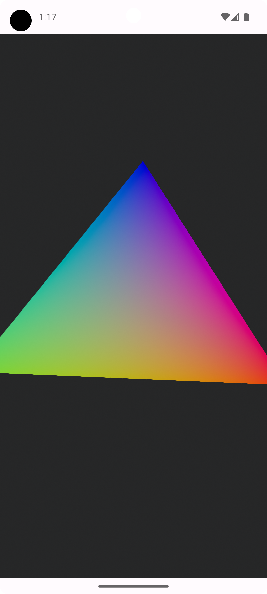
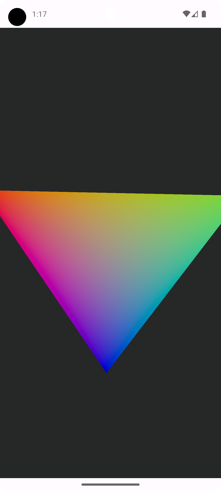

<h1 align="center">Android Filament Triangle</h1>
<h3 align="center">Simple App for creating 3D Triangle with using Filament usage in kotlin.
</h3>

    
    
    
    
    
    

 

    
    

## How to use this repository

1. [Download and Install Android Studio](https://developer.android.com/studio)

3. Clone this repository as an Android Studio project :
     * In Android Studio, click on `File -> New -> Project from Version Control -> Git`
     * Paste this repository *Github URL*, choose a *project directory* and click next.

3. Sync Gradle and run the application on your Android Device!

4. Re-compile your mat file with `matc` tool from [filament](https://github.com/google/filament) in case of update your filament version.

## Keywords

Kotlin, Filament, Android, Android Studio
